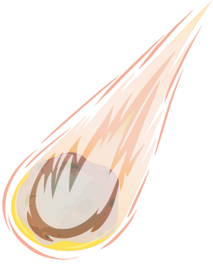
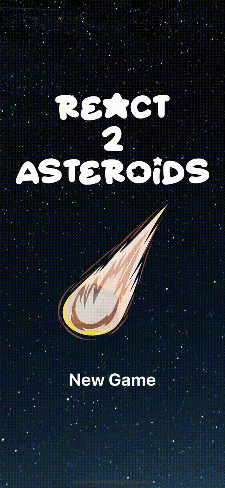

<a name="readme-top"></a>

[![Contributors][contributors-shield]][contributors-url]
[![Forks][forks-shield]][forks-url]
[![Stargazers][stars-shield]][stars-url]
[![Issues][issues-shield]][issues-url]
[![MIT License][license-shield]][license-url]
[![LinkedIn][linkedin-shield]][linkedin-url]

<!-- PROJECT LOGO -->
<br />
<div align="center">
  <a href="https://github.com/davidgarra/react2asteroids">
    
  </a>

<h3 align="center">React2Asteroids</h3>

  <p align="center">
    A simple game with a retro style graphics
    <br />
    <a href="https://github.com/davidgarra/react2asteroids"><strong>Explore the docs »</strong></a>
    <br />
    <br />
    ·
    <a href="https://github.com/davidgarra/react2asteroids/issues">Report Bug</a>
    ·
    <a href="https://github.com/davidgarra/react2asteroids/issues">Request Feature</a>
  </p>
</div>

<!-- TABLE OF CONTENTS -->
<details>
  <summary>Table of Contents</summary>
  <ol>
    <li>
      <a href="#about-the-project">About The Project</a>
      <ul>
        <li><a href="#built-with">Built With</a></li>
      </ul>
    </li>
    <li><a href="#getting-started">Getting Started</a></li>
    <li><a href="#roadmap">Roadmap</a></li>
    <li><a href="#contributing">Contributing</a></li>
    <li><a href="#license">License</a></li>
    <li><a href="#contact">Contact</a></li>
  </ol>
</details>

<!-- ABOUT THE PROJECT -->

## About The Project
<p align="center">
  
</p>

When I was 17 i built some simple games running inside a ms-dos terminal using C.

Those were really simple and one of them was a game where you controlled a spaceship stuck at the bottom of the screen and your goal was to avoid collision with some incoming asteroids. The technology used wasn't the best one, so it was a sort of "tech demo" of what I could make using C and a simple ms-dos terminal.

Obviously the graphics were nothing special, it was done using some simple ASCII characters.

Now, 13 years later, I'm a mobile developer and my favorite framework is React Native. So I tried to recreate a similar tech-demo using JavaScript and React Native without any game engine.

I have chosen to use again a really simple graphics using the same ASCII characters.

For now the app still doesn't have all the features it had in its time, but slowly I will implement all the features introduced at the time.

<p align="right">(<a href="#readme-top">back to top</a>)</p>

### Built With

- [![JavaScript][javascript-shield]][javascript-url]
- [![TypeScript][typescript-shield]][typescript-url]
- [![React][react.js]][react-url]
- [![React-native][reactnative-shield]][reactnative-url]

<p align="right">(<a href="#readme-top">back to top</a>)</p>

<!-- GETTING STARTED -->

## Getting Started

1. **Clone the repository**

   HTTPS:

   ```sh
   git clone https://github.com/davidgarra/react2asteroids.git
   ```

   SSH:

   ```sh
   git clone git@github.com:davidgarra/react2asteroids.git
   ```

2. **Install dependencies using yarn**

   ```shell
   cd react2asteroids
   yarn
   ```

3. **(iOS only) Install Cocoapods and run command**

   ```shell
   cd ios && pod install
   ```

4. **Run the application**

   Android:

   ```sh
   yarn run android
   ```

   iOS:

   ```sh
   yarn run ios
   ```

<p align="right">(<a href="#readme-top">back to top</a>)</p>

<!-- ROADMAP -->

## Roadmap

- [ ] Add unit tests
- [ ] Randomize the number of generated asteroids
- [ ] Add the option to pause the game
- [ ] Add an alternative modern graphics
  - [ ] More modern graphics
  - [ ] Real-time switch
- [ ] Save the user's records
- [ ] Add alternative modern graphics
- [ ] Add logging in and saving records online
- [ ] Handle gestures to move the spaceship

See the [open issues](https://github.com/davidgarra/react2asteroids/issues) for a full list of proposed features (and known issues).

<p align="right">(<a href="#readme-top">back to top</a>)</p>

<!-- CONTRIBUTING -->

## Contributing

Contributions are what make the open source community such an amazing place to learn, inspire, and create. Any contributions you make are **greatly appreciated**.

If you have a suggestion that would make this better, please fork the repo and create a pull request. You can also simply open an issue with the tag "enhancement".
Don't forget to give the project a star! Thanks again!

1. Fork the Project
2. Create your Feature Branch (`git checkout -b feature/AmazingFeature`)
3. Commit your Changes (`git commit -m 'Add some AmazingFeature'`)
4. Push to the Branch (`git push origin feature/AmazingFeature`)
5. Open a Pull Request

<p align="right">(<a href="#readme-top">back to top</a>)</p>

<!-- LICENSE -->

## License

Distributed under the MIT License. See `LICENSE.txt` for more information.

<p align="right">(<a href="#readme-top">back to top</a>)</p>

<!-- CONTACT -->

## Contact

David Garra - [Linkedin](https://www.linkedin.com/in/david-garra/) - david.garra92@gmail.com

Project Link: [https://github.com/davidgarra/react2asteroids](https://github.com/davidgarra/react2asteroids)

<p align="right">(<a href="#readme-top">back to top</a>)</p>

<!-- MARKDOWN LINKS & IMAGES -->
<!-- https://www.markdownguide.org/basic-syntax/#reference-style-links -->

[contributors-shield]: https://img.shields.io/github/contributors/davidgarra/react2asteroids.svg?style=for-the-badge
[contributors-url]: https://github.com/davidgarra/react2asteroids/graphs/contributors
[forks-shield]: https://img.shields.io/github/forks/davidgarra/react2asteroids.svg?style=for-the-badge
[forks-url]: https://github.com/davidgarra/react2asteroids/network/members
[stars-shield]: https://img.shields.io/github/stars/davidgarra/react2asteroids.svg?style=for-the-badge
[stars-url]: https://github.com/davidgarra/react2asteroids/stargazers
[issues-shield]: https://img.shields.io/github/issues/davidgarra/react2asteroids.svg?style=for-the-badge
[issues-url]: https://github.com/davidgarra/react2asteroids/issues
[license-shield]: https://img.shields.io/github/license/davidgarra/react2asteroids.svg?style=for-the-badge
[license-url]: https://github.com/davidgarra/react2asteroids/blob/master/LICENSE.txt
[linkedin-shield]: https://img.shields.io/badge/-LinkedIn-black.svg?style=for-the-badge&logo=linkedin&colorB=555
[linkedin-url]: https://linkedin.com/in/david-garra
[react.js]: https://img.shields.io/badge/React-20232A?style=for-the-badge&logo=react&logoColor=61DAFB
[react-url]: https://reactjs.org/
[reactnative-shield]: https://img.shields.io/badge/React--Native-20232A?style=for-the-badge&logo=react
[reactnative-url]: https://reactnative.dev/
[javascript-shield]: https://img.shields.io/badge/JavaScript-20232A?style=for-the-badge&logo=JavaScript
[javascript-url]: https://developer.mozilla.org/en-US/docs/Web/JavaScript
[typescript-shield]: https://img.shields.io/badge/TypeScript-20232A?style=for-the-badge&logo=typescript
[typescript-url]: https://www.typescriptlang.org/
